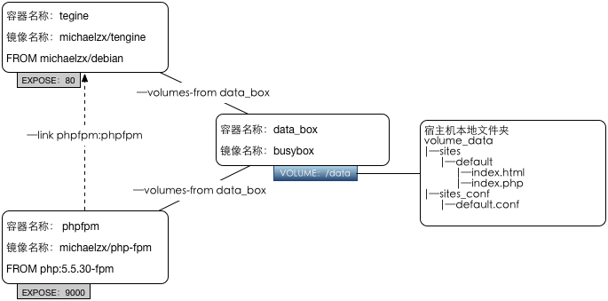

#目录 
* [说明](#说明)
* [结构图](#结构图)
* [目录说明](#目录说明)
* [准备所需依赖镜像](#准备所需依赖镜像)
* [如何构建镜像](#如何构建镜像)
* [如何运行容器](#如何运行容器)
* [遇到的坑](#遇到的坑)
* [Docker相关命令](#docker相关命令)

#说明 
* 个人`练手`和`实践`Docker之作，仅供参考
* 实现Tengine+php-fpm的多容器协作的web应用环境
* 因为在国内速度太慢，没有放到Docker Hub上，需要先下载依赖镜像然后用Dockerfile进行构建。
* 成熟以后计划会把镜像的自动构建任务放到DaoCloud上去
* debian中sources.list使用阿里云了mirror，以便与国内网络环境下更新

#结构图



#目录说明

* /debian：[基础镜像](/debian)

* /tengine：[tengine](/tengine)

* /php-fpm：[php-fpm](/php-fpm)

* /volume_data [数据容器的初始数据](/volume_data)

#准备所需依赖镜像
使用DaoCloud提供的加速器先把依赖镜像先下到本地镜像库中，具体使用方式请见DaoCloud官网：[http://www.daocloud.io/](http://www.daocloud.io/)

```
$ dao pull debian:jessie
$ dao pull php:5.5.30-fpm
$ dao pull busybox
$ dao pull mysql:5.7.9
```
另外还有一个`michaelzx/debian:jessie`镜像需要build，主要用于构建起他镜像。

本项目中的[/tengine](/tengine)是From该镜像，如果有需要的话，可以自行扩展。我就是放着备用而已。

```
$ docker build --rm -t michaelzx/debian:jessie zx_docker_path/debian/.
```                                                  

#构建和运行

这里用到了docker-compose

1、新建一个文件夹`/my_path/data`,将[volume_data](/volume_data)中的文件放进去。

2、修改docker-compose.yml中的配置

```
data_box:
    container_name: data_box
    image: "busybox"
    volumes:
        - ~/workspace/Docker/docker_data:/data
    stdin_open: true
```
把这里的`~/workspace/Docker/docker_data`改成你的`/my_path/data`

```
mysql_box:
    container_name: mysql_box
    image: "mysql:5.7.9"
    ports:
        - "3306:3306"
    environment:
        - MYSQL_ROOT_PASSWORD=root
```

这里可以修改你的mysql的root密码

`说明`：在mac osx下如果要挂在volume可能会出现权限问题，会无法正常启动mysql容器。
解决方法还没找到，有知道的朋友不妨告知一下。

2、build镜像

```
$ docker-compose build
```

3、初始化并在后台运行容器

```
$ docker-compose up -d
```

#遇到的坑

###【问题一】`http://x.x.x.x/index.PHP`居然可以被下载
实践环境是在mac os上装了Docker ToolBox，部署完毕以后，发现`http://x.x.x.x/index.php`可以被正常访问，但是`http://x.x.x.x/index.PHP`居然可以被下载。理论上index.PHP这个文件应该是不存在的。按照配置，应该是被分配到phpfpm中运行。但为什么又被当成默认文件类型提供了下载？

【分析】进入`tengine容器`找到网站目录运行一下命令

```
# cd /data/sites/default/
# cat index.php
<?php phpinfo();?>
# cat index.PHP
<?php phpinfo();?>
```
可见在此路径下，文件不区分大小写。难道基础镜像有问题？

那到镜像自带的/tmp目录下试试

```
# cd /tmp
# echo "test">index.php
# ls
# index.php
# cat index.php
# test
# cat index.PHP
# cat: index.PHP: No such file or directory
```
可见此目录下是区分大小写的。 

所以主要是还和/data有关，而/data是挂载上去的volume。

这个volume指向的是max os的本地目录。于是我都mac下的命令行终端试了下，果然不区分大小写。网上找了下资料，其实mac os分区格式有2种：  
1、Mac OS 扩展（区分大小写，日志式）  
2、Mac OS 扩展（日志式）  
我去磁盘工具里面看了下。我的分区格式是第二种。 

于是造成了这个问题。

所以通过这点，也再次提醒了我，`docker并非一个以往意义上的完全独立的虚拟环境`，


【解决方案】还没找到，不过正式的服务器环境应该不会有这种问题吧。

###【问题二】OSX下在mysql中挂载volume的话会导致无法启动

如果不挂载volume完全正常，`一直解决不了`这个问题，非常纠结，有知道的朋友还请指点一下。

#Docker相关命令

##镜像和容器的清理

###删除所有运行中的容器

```
$ docker kill $(docker ps -q)
```

###删除所有停止的容器

```
$ docker rm $(docker ps -a -q)
```

###删除所有没有tag和挂起的镜像

```
docker rmi $(docker images -q -f dangling=true)
```

###删除所有镜像

```
docker rmi $(docker images -q)
```